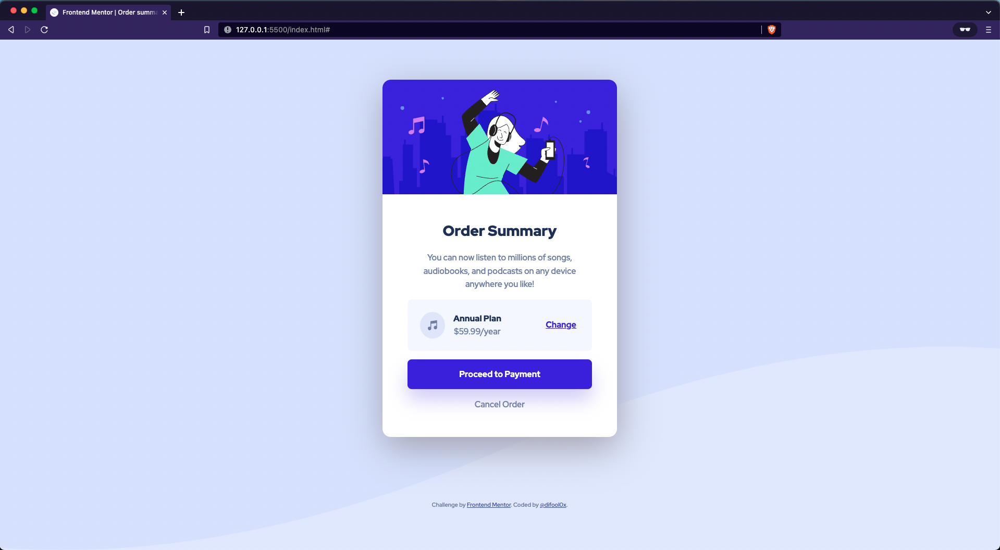

# Frontend Mentor - Order summary card solution

This is a solution to the [Order summary card challenge on Frontend Mentor](https://www.frontendmentor.io/challenges/order-summary-component-QlPmajDUj). Frontend Mentor challenges help you improve your coding skills by building realistic projects.

## Table of contents

-   [Overview](#overview)
    -   [The challenge](#the-challenge)
    -   [Screenshot](#screenshot)
    -   [Links](#links)
-   [My process](#my-process)
    -   [Built with](#built-with)
    -   [What I learned](#what-i-learned)
    -   [Useful resources](#useful-resources)
-   [Author](#author)
-   [Acknowledgments](#acknowledgments)

## Overview

### The challenge

Users should be able to:

-   See hover states for interactive elements

### Screenshot

### Links

-   Solution URL: [https://github.com/difooldevs/order-summary-component](https://github.com/difooldevs/order-summary-component)
-   Live Site URL: [https://difooldevs.github.io/order-summary-component](https://difooldevs.github.io/order-summary-component/)

## My process

### Built with

-   Semantic HTML5 markup
-   CSS custom properties
-   Flexbox
-   CSS Grid
-   Andy Bell's CUBE CSS methodology (loosly)
-   Andy Bell's CSS reset

### What I learned

I learned about the CUBE CSS methodology.

### Useful resources

-   [Piccalil CSS Reset](https://piccalil.li/blog/a-modern-css-reset/) - A modern CSS reset by Andy Bell.
-   [CUBE CSS Methodology](https://cube.fyi/) - Documentation for CUBE CSS.
-   [Kevin Powell YouTube Channel](https://www.youtube.com/watch?v=NanhQvnvbR8) - Introduced me to the CUBE CSS method.

## Author

-   Website - [difool](https://www.difool.dev)
-   Frontend Mentor - [@yourusername](https://www.frontendmentor.io/profile/difooldevs)
-   Twitter - [@difool0x](https://www.twitter.com/difool0x)

**Note: Delete this note and add/remove/edit lines above based on what links you'd like to share.**

## Acknowledgments

Thanks to Andy Bell for the CSS reset and CUBE method as well as Kevin Powell for introducing me to these resources.
